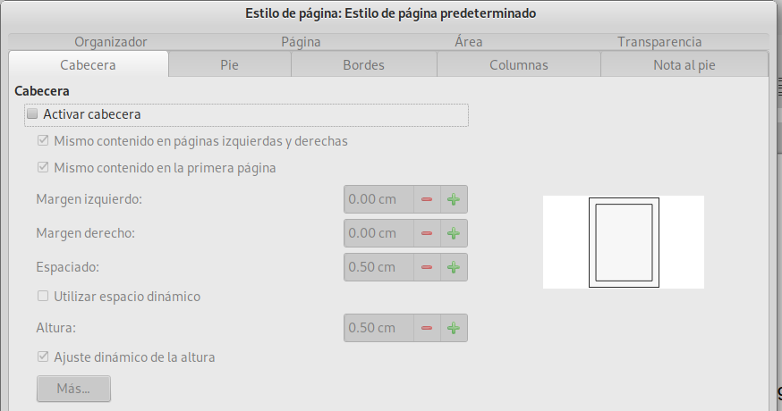

# Ejercicio sobre encabezados y pies de página

En esta práctica conocerás como activar el encabezado y el pie de página. El encabezado o cabecera y pie de página, son opciones que se aplican a todas las páginas del documento, solo podemos hacer una diferencia en la primer página. La activación de esta opción la haremos a través del 

## Menú Estilo de página

Recordando como utilizar esta opción, no vamos a la barra del _menú -> Formato -> Estilo de página_, el cual utlizamos en la práctica pasada, se abre la ventana de opciones de __Estilo de página__ 

.

Como podrás observar, el recuadro se abre con pestañas de opciones, en primer lugar utilizamos la opción de __Cabecera__, hay que activar la casilla de _Activar cabecera_ para que se active en la página y las diversas opciones que se presentan, tales como márgenes ubicación, etc.

En la opción de __Más...__, accedemos a opciones que sirven para decorar y darle un estilo personal a la cabecara de las páginas de nuestro documento, prueba utilizando cualquier texto, o el de [EL DERECHO A LEER](02-ejercicio-tipografia/el-derecho-a-leer.txt), o bien tu texto ya guardado en __LibreOffice__. En estas opciones podemos darle un borde o marco al encabezado, color de fondo, entre otras.

Para el pie de página las indicaciones y opciones son las mismas, prueba y personaliza tus documentos. Te presento un ejemplo de como puede verse un encabezado, estoy seguro que lo harás verse mucho mejor.

